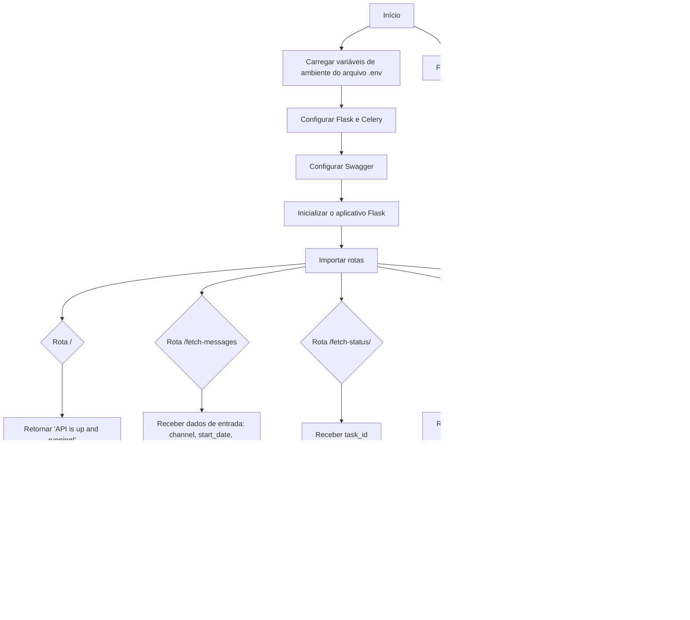

```mermaid

flowchart TD
    A[Início] --> B[Carregar variáveis de ambiente do arquivo .env]
    B --> C[Configurar Flask e Celery]
    C --> D[Configurar Swagger]
    D --> E[Inicializar o aplicativo Flask]
    E --> F[Importar rotas]
    F --> G{Rota /}
    G --> H[Retornar 'API is up and running!']
    F --> I{Rota /fetch-messages}
    I --> J[Receber dados de entrada: channel, start_date, end_date]
    J --> K[Validar dados de entrada]
    K --> L[Iniciar tarefa fetch_messages_task]
    L --> M[Retornar task_id]
    F --> N{Rota /fetch-status/<task_id>}
    N --> O[Receber task_id]
    O --> P[Obter status da tarefa]
    P --> Q[Retornar status e resultado da tarefa]
    F --> R{Rota /top-repliers}
    R --> S[Receber dados de entrada: channel_id, start_date, end_date, top_n]
    S --> T[Validar dados de entrada]
    T --> U[Iniciar tarefa calculate_top_repliers_task]
    U --> V[Retornar task_id]
    F --> W{Rota /task-status/<task_id>}
    W --> X[Receber task_id]
    X --> Y[Obter status da tarefa]
    Y --> Z[Retornar status e resultado da tarefa]
    A --> AA[Fim]
```